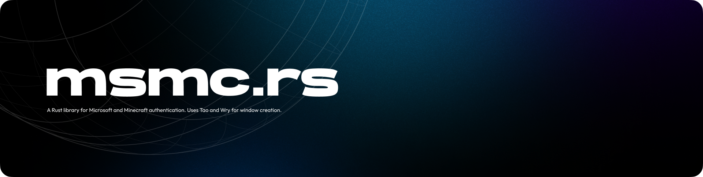

# Alpha 0.0!

**We are currently planning this project. Soon, it will have features, and be usable.**

A Rust library for Microsoft and Minecraft authentication. Uses Tao and Wry for window creation, for logging in.

Check out [mcln.rs](https://crates.io/crates/msmc) if you need a Minecraft launcher library, but we'll start working on that after this project is working.
